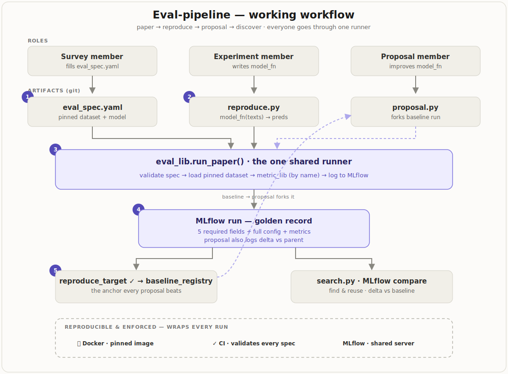
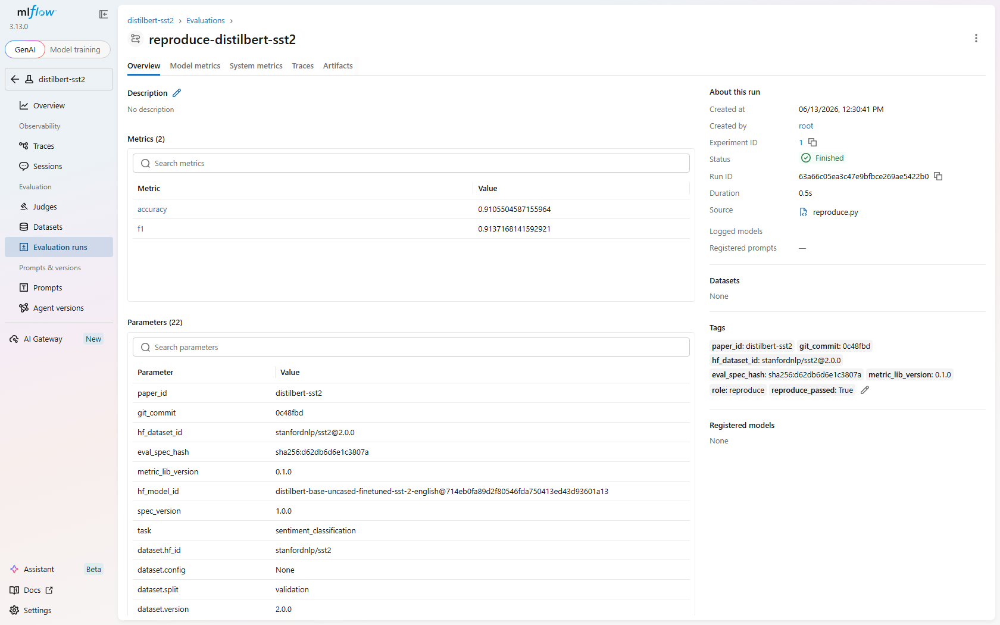
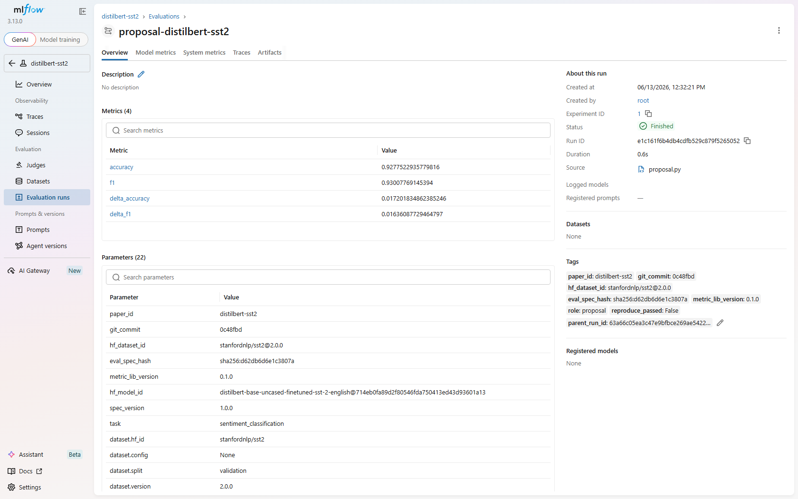
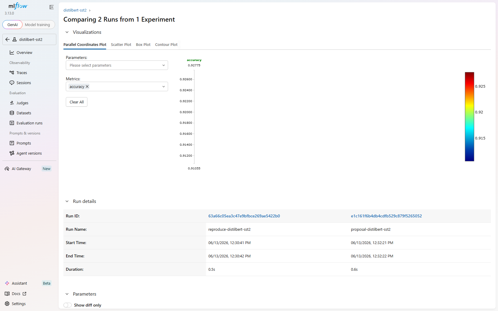

# eval-pipeline

A **shared evaluation standard** for the research group: one contract, one
metric library, one runner — so reproduce results are comparable, reusable,
and have a clear baseline for proposals.

This repo is the **reference bundle** that runs the whole standard end-to-end
in Docker. The standard itself is split across dedicated repos (below); here
`eval-lib` is a pinned dependency and `paper-registry` is a git submodule.



## The org, in three layers

| Repo | Layer | Role |
|---|---|---|
| [eval-lib](https://github.com/dream-ai-lab/eval-lib) | standard | Installable package: metrics, spec validation, MLflow runner. Pin a version. |
| [paper-registry](https://github.com/dream-ai-lab/paper-registry) | contract | Central `eval_spec.yaml` catalog + baselines. Survey members PR specs. |
| [experiment-template](https://github.com/dream-ai-lab/experiment-template) | experiment | "Use this template" → a new `reproduce-<paper>` repo, pinned to eval-lib. |
| reproduce-[sst2](https://github.com/dream-ai-lab/reproduce-distilbert-sst2) · [emotion](https://github.com/dream-ai-lab/reproduce-distilbert-emotion) | experiment | Team-owned repos. No PR back to central. |
| **eval-pipeline** (this repo) | bundle | Runs everything together + shared MLflow + docs + discovery tools. |


## What's here

| Path | What it is |
|---|---|
| `experiments/` | Per-paper `reproduce.py` / `proposal.py` (you only write `model_fn`) |
| `paper-registry/` | **submodule** → the spec catalog |
| `tools/search.py` | Find teammates' runs and dump their full config |
| `docker/` | `mlflow` server + pinned `runner` image (installs `eval-lib`) |
| `docs/` | Onboarding — start at [docs/01-overview.md](docs/01-overview.md) |

## Quickstart (Docker — proves reproducibility)

```bash
git clone --recursive https://github.com/dream-ai-lab/eval-pipeline   # pulls the submodule
./run.sh        # Linux / macOS
```
```powershell
.\run.ps1       # Windows
```

Builds the image, starts MLflow, runs both reproduces + the proposal, then
open the MLflow UI at http://localhost:5000.

## Proven results

| Experiment | Metric | Result | Paper-reported | Target |
|---|---|---|---|---|
| reproduce `distilbert-sst2` | accuracy | **0.9106** | 0.913 | [0.90, 0.92] ✓ |
| proposal `distilbert-sst2` (ensemble) | accuracy | **0.9278** | — | delta **+0.017** |
| reproduce `distilbert-emotion` | macro-F1 | **0.9065** | — | [0.80, 0.95] ✓ |

## What it looks like

Every run records its full config + golden record, and proposals show the
auto-computed delta against the baseline:

| Reproduce run (full config) | Proposal run (auto delta) |
|---|---|
|  |  |

Compare reproduce vs proposal directly — no spreadsheet:



## Find a teammate's result

```bash
export MLFLOW_TRACKING_URI=http://<server>:5000          # Linux/macOS
# $env:MLFLOW_TRACKING_URI = "http://<server>:5000"      # Windows PowerShell
python tools/search.py --role reproduce --filter "metrics.accuracy > 0.90"
python tools/search.py --run <run_id>   # full config: every param + the spec
```

See [docs/07-finding-results.md](docs/07-finding-results.md).

New here? Read [docs/02-quickstart.md](docs/02-quickstart.md) then
[docs/03-add-a-new-paper.md](docs/03-add-a-new-paper.md).
