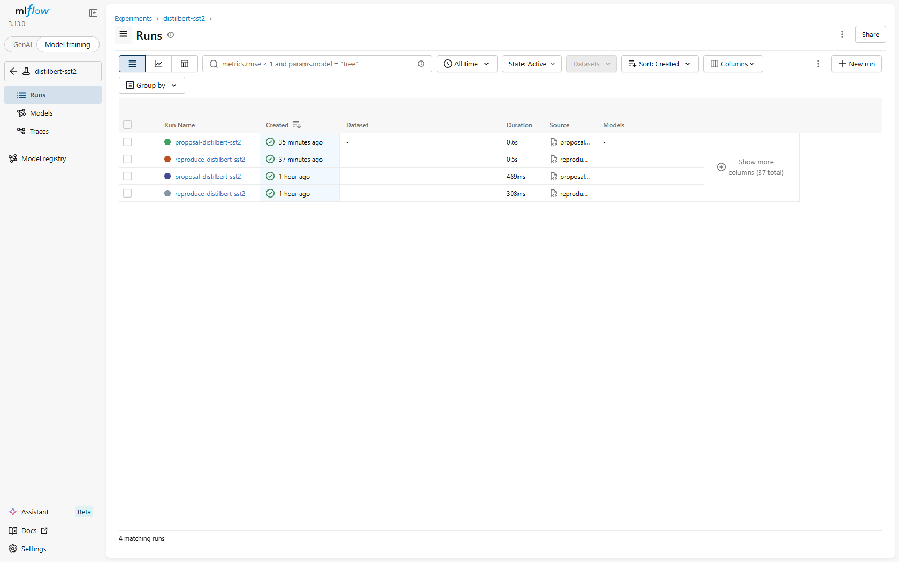

# 07 — Finding a teammate's results

Every run logs its **full config** to W&B, so you can discover what someone
already ran and see exactly how — without asking them.

Point your tools at the shared W&B workspace once:

```bash
export WANDB_ENTITY=<team>                # Linux / macOS
export WANDB_PROJECT=eval-lib
```
```powershell
$env:WANDB_ENTITY = "<team>"             # Windows
$env:WANDB_PROJECT = "eval-lib"
```

## Option A — the `search.py` CLI (terminal / scriptable)

```powershell
# every run for a paper, newest first
python tools/search.py --paper distilbert-sst2

# cross-paper: only accepted reproduces above 0.90
python tools/search.py --role reproduce --filter "metrics.accuracy > 0.90"

# the full config of one run (all params, tags, metrics, + the spec artifact)
python tools/search.py --run 63a66c05ea3c47e9bfbce269ae5422b0
```

The run group's Runs table lists every reproduce/proposal run:



A `--run` dump shows everything needed to reuse the result:

```
-- params (full config) --
  dataset.hf_id        = stanfordnlp/sst2
  dataset.revision     = 8d51e7e4887a4caaa95b3fbebbf53c0490b58bbb
  dataset.split        = validation
  inference.seed       = 42
  inference.max_length = 256
  inference.batch_size = 32
  model.hf_id          = distilbert-base-uncased-finetuned-sst-2-english
  model.revision       = 714eb0fa89d2f80546fda750413ed43d93601a13
  metrics.primary      = accuracy
  ...
-- artifacts -- (exact spec)
  eval_spec/eval_spec.yaml
```

## Option B — the W&B UI (point-and-click)

Open `https://wandb.ai/<entity>/<project>`, pick the run group (= `paper_id`),
and use the filter bar, e.g.:

```
tags.role = 'proposal' and metrics.accuracy > 0.92
config.inference.seed = 42
```

Each run's detail page shows the full config (all params/config) and the golden
record tags:


Select two runs and hit **Compare** to diff their config and metrics side by
side. The attached `eval_spec.yaml` is under each run's **Files** tab.


## What you can filter on

- **tags:** `paper_id`, `role`, `reproduce_passed`, `eval_spec_hash`,
  `git_commit`, `metric_lib_version`, `parent_run_id`
- **params:** every config scalar — `dataset.revision`, `dataset.split`,
  `model.revision`, `inference.seed`, `inference.max_length`, `spec_version`, …
- **metrics:** the primary/secondary scores, plus `delta_*` on proposals

Because the dataset/model revisions and the `eval_spec_hash` are all logged,
two runs with the same hash were measured under the identical contract — that
is your guarantee the numbers are comparable.
